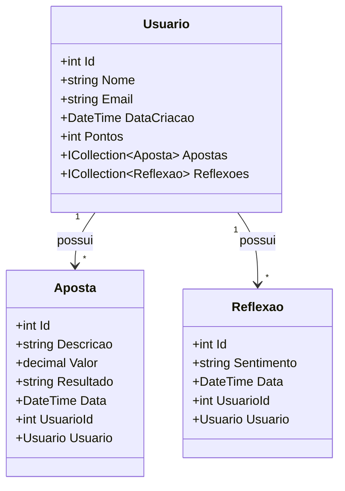
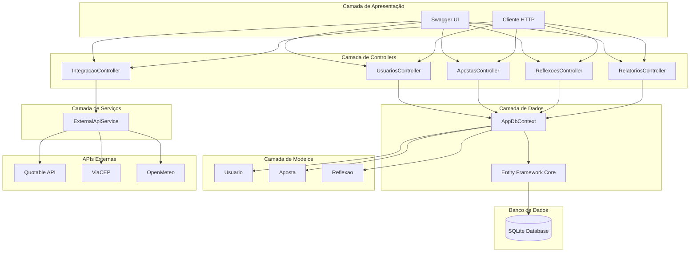

# 🎲 XPeriencia - Aplicativo de Apoio contra o Vício em Apostas

## 👥 Integrantes
- Guilherme Doretto Sobreiro **RM:99674** 
- Guilherme Fazito Ziolli Sordili **RM:550539** 
- Raí Gumieri dos Santos **RM:98287**  

---

## 📌 Descrição do Projeto
O **XPeriencia** é uma aplicação desenvolvida em **C# (console application)** com o objetivo de apoiar pessoas que desejam **monitorar seus hábitos de apostas** e refletir sobre suas ações, auxiliando no combate ao vício em jogos de azar.  

O sistema permite cadastrar usuários, registrar apostas, escrever reflexões pessoais e gerar relatórios.  
Para simplificar o armazenamento (substituindo um banco de dados real), foram utilizados **arquivos JSON** para persistência e **relatórios em TXT** para acompanhamento.  

---

## ⚙️ Funcionalidades
- **Usuários**  
  - Criar, listar, editar e excluir usuários.  
  - Cada usuário tem: ID, Nome, Email, Data de criação e Pontos.  

- **Apostas**  
  - Registrar apostas vinculadas a um usuário.  
  - Ganhos e perdas impactam diretamente os pontos do usuário.  
  - Cada aposta contém: ID, Descrição, Valor, Data e Resultado (G/P).  

- **Reflexões**  
  - Espaço para que o usuário registre pensamentos e reflexões sobre sua jornada.  
  - CRUD completo (incluir, editar, listar e excluir).  

- **Relatórios (TXT)**  
  - Relatório detalhado por usuário.  
  - Inclui lista de apostas, reflexões e resumo estatístico:  
    - Total de apostas feitas  
    - Quantidade de ganhos e perdas  
    - Pontos finais  

---
## 🗂️ Diagrama de Pacotes / Estrutura do Projeto

📦 XPeriencia

┣ 📂 Models # Classes que representam as entidades

┃ ┣ 📜 Aposta.cs # Estrutura de dados para Aposta

┃ ┣ 📜 Reflexao.cs # Estrutura de dados para Reflexão

┃ ┗ 📜 Usuario.cs # Estrutura de dados para Usuário

┣ 📂 Services # Serviços responsáveis pelo CRUD

┃ ┣ 📜 ApostaService.cs # Operações de CRUD para Apostas

┃ ┣ 📜 DataManager.cs # Gerencia leitura e escrita em arquivos JSON/TXT

┃ ┣ 📜 ReflexaoService.cs # Operações de CRUD para Reflexões

┃ ┣ 📜 RelatorioService.cs # Geração de relatórios em TXT com estatísticas

┃ ┗ 📜 UsuarioService.cs # Operações de CRUD para Usuários


┣ 📜 Program.cs # Menu principal e fluxo do sistema


┗ 📜 README.md # Este arquivo

---

## 💻 Tecnologias Utilizadas
- **C# .NET 8.0**  
- **JSON** (persistência de dados simulando banco)  
- **TXT** (relatórios)  
- **Console Application** (interface)  

---

## 📊 Requisitos Atendidos
✔ Estruturação de classes e código limpo (25%)  
✔ Manipulação de arquivos JSON/TXT (20%)  
✔ CRUD completo (20%)  
✔ Interface Console (15%)  
✔ Documentação do projeto (10%)  
✔ Arquitetura em diagramas (10%)  

---

## 🚀 Como Executar
1. Clone este repositório.  
2. Abra o projeto no **Visual Studio** ou **Visual Studio Code**.  
3. Compile e execute o programa.  
4. Os arquivos de dados serão armazenados automaticamente na pasta `Data/`.  

---

## 📎 Observações
- O projeto não utiliza banco de dados real, mas sim arquivos JSON, conforme alternativa permitida pelo professor.  
- O relatório TXT é gerado para cada usuário, facilitando a análise dos resultados.  

--- 

## Diagrama de Classes 
<div align="center"> 
  
</div>

--- 

---

# 🚀 Sprint 4 - Evolução para API REST

## 👥 Integrantes
- Guilherme Doretto Sobreiro **RM:99674** 
- Guilherme Fazito Ziolli Sordili **RM:550539** 
- Raí Gumieri dos Santos **RM:98287** 

## 📌 Descrição do Projeto

Na **Sprint 4**, o projeto XPeriencia evoluiu de uma aplicação console para uma **API RESTful completa** utilizando **ASP.NET Core Web API**. A aplicação agora oferece endpoints para integração com outros sistemas, persistência robusta com **Entity Framework Core**, consultas avançadas com **LINQ** e integrações com **APIs externas**.

---

## 🆕 Novas Tecnologias Implementadas

- **ASP.NET Core Web API** - Framework para desenvolvimento da API REST
- **Entity Framework Core** - ORM para persistência de dados
- **SQLite** - Banco de dados relacional
- **Swagger/OpenAPI** - Documentação interativa da API
- **LINQ** - Consultas avançadas e manipulação de dados
- **HttpClient** - Integração com APIs externas

---

## 🏗️ Nova Arquitetura do Projeto
```
XPeriencia.API/
├── Controllers/         # Endpoints da API REST
│   ├── UsuariosController.cs
│   ├── ApostasController.cs
│   ├── ReflexoesController.cs
│   ├── RelatoriosController.cs
│   └── IntegracaoController.cs
├── Models/             # Entidades do domínio
│   ├── Usuario.cs
│   ├── Aposta.cs
│   └── Reflexao.cs
├── Data/               # Contexto do banco de dados
│   ├── AppDbContext.cs
│   └── AppDbContextFactory.cs
├── Services/           # Serviços e lógica de negócio
│   └── ExternalApiService.cs
├── Migrations/         # Migrações do Entity Framework
├── appsettings.json    # Configurações da aplicação
└── Program.cs          # Configuração e inicialização da API
```

---

## 🔌 Endpoints da API

### 👤 Usuários (`/api/usuarios`)
- `GET /api/usuarios` - Lista todos os usuários
- `GET /api/usuarios/{id}` - Busca usuário por ID
- `GET /api/usuarios/email/{email}` - Busca usuário por email
- `POST /api/usuarios` - Cria novo usuário
- `PUT /api/usuarios/{id}` - Atualiza usuário
- `DELETE /api/usuarios/{id}` - Remove usuário

### 🎲 Apostas (`/api/apostas`)
- `GET /api/apostas` - Lista todas as apostas
- `GET /api/apostas/{id}` - Busca aposta por ID
- `GET /api/apostas/usuario/{usuarioId}` - Apostas de um usuário específico
- `GET /api/apostas/resultado/{resultado}` - Filtra apostas por resultado
- `POST /api/apostas` - Registra nova aposta
- `PUT /api/apostas/{id}` - Atualiza aposta
- `DELETE /api/apostas/{id}` - Remove aposta

### 💭 Reflexões (`/api/reflexoes`)
- `GET /api/reflexoes` - Lista todas as reflexões
- `GET /api/reflexoes/{id}` - Busca reflexão por ID
- `GET /api/reflexoes/usuario/{usuarioId}` - Reflexões de um usuário
- `GET /api/reflexoes/sentimento/{sentimento}` - Filtra por sentimento
- `POST /api/reflexoes` - Registra nova reflexão
- `PUT /api/reflexoes/{id}` - Atualiza reflexão
- `DELETE /api/reflexoes/{id}` - Remove reflexão

### 📊 Relatórios com LINQ (`/api/relatorios`)
- `GET /api/relatorios/usuario/{usuarioId}` - Relatório completo do usuário
- `GET /api/relatorios/geral` - Estatísticas gerais do sistema
- `GET /api/relatorios/apostas/periodo` - Apostas filtradas por período

### 🌐 Integrações Externas (`/api/integracao`)
- `GET /api/integracao/frase-motivacional` - Frase inspiradora aleatória
- `GET /api/integracao/cep/{cep}` - Consulta endereço por CEP
- `GET /api/integracao/clima` - Dados meteorológicos em tempo real
- `GET /api/integracao/motivacao-para-usuario/{usuarioId}` - Motivação personalizada

---

## 🔍 Exemplos de Uso com LINQ

A API utiliza **LINQ** extensivamente para consultas e agregações complexas:
```csharp
// Agrupamento de apostas por resultado
var apostasPorResultado = apostas
    .GroupBy(a => a.Resultado)
    .Select(g => new { 
        Resultado = g.Key, 
        Quantidade = g.Count(),
        ValorTotal = g.Sum(a => a.Valor) 
    });

// Cálculo de estatísticas
var media = apostas.Average(a => a.Valor);
var maiorAposta = apostas.Max(a => a.Valor);
var menorAposta = apostas.Min(a => a.Valor);

// Top 5 usuários com mais apostas
var topUsuarios = usuarios
    .OrderByDescending(u => u.Apostas.Count)
    .Take(5);

// Filtro por período
var apostasPeriodo = apostas
    .Where(a => a.Data >= dataInicio && a.Data <= dataFim)
    .OrderByDescending(a => a.Data);
```

---

## 🌐 APIs Externas Integradas

### 1. **Quotable API**
- **Função:** Fornece frases motivacionais aleatórias
- **Endpoint:** `GET /api/integracao/frase-motivacional`
- **Uso:** Motivar usuários em sua jornada

### 2. **ViaCEP**
- **Função:** Consulta dados de endereços brasileiros por CEP
- **Endpoint:** `GET /api/integracao/cep/{cep}`
- **Exemplo:** `/api/integracao/cep/01310100`

### 3. **OpenMeteo**
- **Função:** Dados meteorológicos em tempo real
- **Endpoint:** `GET /api/integracao/clima?latitude=-23.5505&longitude=-46.6333`
- **Uso:** Fornecer contexto ambiental aos usuários

---

## 📐 Diagramas de Arquitetura 

### 1. Diagrama de Classes (Modelo de Dados)


### 2. Arquitetura em Camadas


---

## 🚀 Como Executar a API (Sprint 4)

### Pré-requisitos
- .NET 6.0 SDK ou superior
- Visual Studio 2022 ou VS Code
- Git

### Passo a passo

1. **Clone o repositório**
```bash
git clone https://github.com/raigumieri/Projeto_XPeriencia.git
cd Projeto_XPeriencia
```

2. **Navegue até o projeto da API**
```bash
cd XPeriencia.API
```

3. **Restaure os pacotes**
```bash
dotnet restore
```

4. **Execute as migrations**
```bash
dotnet ef database update
```

5. **Execute a aplicação**
```bash
dotnet run
```

6. **Acesse o Swagger**
```
http://localhost:5045/swagger
```
---

## 🔄 Evolução: Sprint 3 → Sprint 4

### Sprint 3 (Console)
- ✅ Aplicação Console
- ✅ Persistência em JSON
- ✅ Relatórios em TXT
- ✅ CRUD básico

### Sprint 4 (API REST)
- ✅ API RESTful completa
- ✅ Entity Framework + SQLite
- ✅ Swagger/OpenAPI
- ✅ LINQ avançado
- ✅ Integrações externas
- ✅ Arquitetura escalável
- ✅ Pronto para cloud

---

## 🎯 Conclusão

O projeto **XPeriencia** evoluiu significativamente da Sprint 3 para a Sprint 4, mantendo seu propósito original de auxiliar pessoas no combate ao vício em apostas, mas agora com uma arquitetura moderna, escalável e pronta para integração com outros sistemas e plataformas.

---
